# Artificial Intelligence

## Intro

- Watch [Coding Train - What is Machine Learning (first 16 min)](https://www.youtube.com/watch?v=LvIa0-ZKCrc&list=PLRqwX-V7Uu6bCN8LKrcMa6zF4FPtXyXYj)

The last decade there's been a lot of buzz around Machine Learning, Artificial Intelligence and Deep learning. The explosion in computer performance, especially with GPUs has enabled new possibilities in making computers seem intelligent.

You'll see the terms Artificial Intelligence, Machine Learning and Deep Learning getting mixed together a lot. They're actually a subset of eachother:

Artificial Intelligence contains Machine Learning, which contains Deep Learning:


Image Source: https://blogs.nvidia.com/blog/2016/07/29/whats-difference-artificial-intelligence-machine-learning-deep-learning-ai/ 

Using Machine Learning, you can make a computer do things, without explicitly programming that task. There are roughly 3 types of tasks which can be executed using Machine Learning:

1. Classification: Label data, based on certain inputs. An example would be OCR: given an image of a letter, predicting which letter it is.
2. Regression: Calculating a single value based on a number of inputs. For example: calculating the price of a house, based on data such as number of bedrooms, square meters, neighbourhood, ...
3. Clustering: Group data together. In contrast with Classification, the groups / labels are not known in advance. An example is analyzing customer behaviour (customers also bought...)

Training the algorithm can happen in different ways:

1. Supervised Learning: An algorithm learns, based on example input data with the correct answers. For example: we give the computer a list of housing data with corresponding prices. Or a list of images of letters, with the corresponding letter label. (this is a letter A, this is a letter B, ...)
2. Unsupervised Learning: The algorithm learns by itself, based on input data. Used mostly with clustering tasks.
3. Reinforcement Learning: The algorithm gets a reward when it performs well, and gets punished when it performs badly. Example would be learning to play a game automatically.

## Neural Networks

A Neural Network is built with different layers of "neurons", who are all connected to eachother. Every connection has a "weight", which affects the influence of a given neuron.


Image Credit: http://cs231n.github.io/neural-networks-1/

A non-trained network will have random weights and won't give you good results. By training a network with example data, you'll tweak the weights little by little, until our network (hopefully) performs well.

Beware of creating algorithmic bias when training models. Watch [How I'm fighting bias in algorithms by Joy Buolamwini](https://www.youtube.com/watch?v=UG_X_7g63rY)

### Image Generators

You might have seen https://thispersondoesnotexist.com/ - each time you visit the page, you'll see a photo of a person, entirely generated by a machine learning network. Or try detecting which person is real and which person is generated at http://www.whichfaceisreal.com.

AI driven image generators are improving every year. By providing a text prompt, a model will try to generate an image that corresponds to your prompt.

## Teachable Machine

We will be re-training models to create interactive experiences in Javascript. The framework we'll use is Google's Teachable Machine.

Watch [The Teachable Machine video](https://www.youtube.com/watch?v=T2qQGqZxkD0) and continue to https://teachablemachine.withgoogle.com

### Head Tilt Breakout

We'll build a version of the "Breakout" arcade game, which we'll control by tilting our head.

#### 1. Train a pose model

Follow [The head tilt tutorial](https://medium.com/@warronbebster/teachable-machine-tutorial-head-tilt-f4f6116f491) to train a model to detect head poses. As a final step, download a ZIP file with your retrained model (for Tensorflow.js).

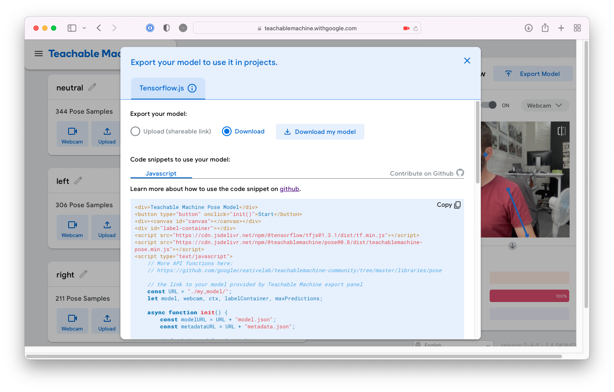

The download dialog shows a snippet of javascript code to run your model. Create an empty folder for this exercise, and an index.html with some boilerplate html (html, head, title, body, ...) code in that folder. Copy/Paste the code snippet from TeachableMachine into the body of that html file and take a closer look at the code.

You'll notice it looks for the model files in a folder called "my_model":

```javascript
// the link to your model provided by Teachable Machine export panel
const URL = "./my_model/";
```

Create a folder called `my_model` inside of your project folder, and put the model files from the zip file inside of that folder.

Open the index.html file in your Live Server and test the application. After clicking the start button, you should see your webcam image and the classification labels being updated based upon your pose.

Adjust the demo code, so it uses arrow functions instead of ES5 functions.

#### 2. Move a paddle

Find the line where the model runs on the webcam input:

```javascript
const prediction = await model.predict(posenetOutput);
```

Log that prediction. What data type is this? How can you find the most accurate prediction (neutral, left or right)?

Create a global variable `paddleX` which will store the x position where to draw the box at the bottom of our game:

```javascript
let paddleX = 100;
```

In the prediction loop, write the necessary code so that:
1. we get the prediction with the highest confidence
2. if the classifier is "left", decrease the paddleX value, if it is "right" increase the paddleX value.
3. log the paddleX variable.

Once the paddleX variable is being logged, create a new function "drawPaddle" which draws a rectangle at the paddleX position, at the bottom of the canvas. Call that drawPaddle function and see it moved based upon your position.

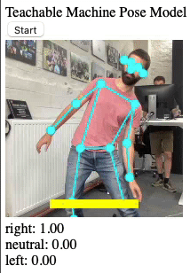

#### 3. Speed up development

It's a bit annoying to wait for the model and webcam to load every time we make some code changes. In order to speed up our development, we'll disable the model and webcam for now.

Comment out the model and webcam initialization in the init function:

```javascript
// const modelURL = URL + "model.json";
// const metadataURL = URL + "metadata.json";

// // load the model and metadata
// // Refer to tmImage.loadFromFiles() in the API to support files from a file picker
// // Note: the pose library adds a tmPose object to your window (window.tmPose)
// model = await tmPose.load(modelURL, metadataURL);
// maxPredictions = model.getTotalClasses();

// // Convenience function to setup a webcam
// const size = 200;
// const flip = true; // whether to flip the webcam
// webcam = new tmPose.Webcam(size, size, flip); // width, height, flip
// await webcam.setup(); // request access to the webcam
// await webcam.play();
// window.requestAnimationFrame(loop);
```

Move the `const size = 200;` to the global section of your code:

```javascript
const URL = "./my_model/";
let model, webcam, ctx, labelContainer, maxPredictions;
const size = 200;
let paddleX = 100;
```

Create a new `draw()` function which calls the `drawPaddle()` function and schedules the next draw call:

```javascript
const draw = () => {
  drawPaddle();
  requestAnimationFrame(draw);
}
```

Schedule the first draw call at the end of the `init()` function:

```javascript
requestAnimationFrame(draw);
```

Click the Start button. You should see the yellow rectangle on the screen.

We'll need to control the paddle without posenet as well for debugging purposes. So add an event listener for key press events in your init function:

```javacript
document.addEventListener("keydown", keyDownHandler, false);
```

And adjust the paddle position in that key down handler:

```javascript
const keyDownHandler = (e) => {
  if (e.keyCode == 39) {
    paddleX += 10;
  }
  else if (e.keyCode == 37) {
    paddleX -= 10;
  }
}
```

You should be able to control the paddle with your arrow keys. As we are not clearing the canvas on each draw, we keep on drawing on the previous content.

Add a `clearRect` call at the start of the `draw()` function and test again.

#### 4. Bouncing ball

Create some variables at the top which will controll the ball:

```javascript
let ballX = 100, ballY = 170, ballSize = 5, ballSpeedX = 5, ballSpeedY = -5;
```

Write a `drawBall` function which draws a ball on the screen on the given position. Update the ball position as well:

```javascript
const drawBall = () => {
  ctx.beginPath();
  ctx.arc(ballX, ballY, ballSize, 0, Math.PI * 2);
  ctx.fillStyle = "red";
  ctx.fill();
  ctx.closePath();

  ballX += ballSpeedX;
  ballY += ballSpeedY;
}
```

Add a call to the `drawBall()` function in your `draw()` function. You should see the ball move on your screen.

Add some extra logic in the `drawBall()` function, so that:

- the ball bounces on the left, right and top side of the canvas. You can do this by writing if statements and adjusting the `ballSpeedX/Y` variables.
- we log a "you loose" message when the ball hits the bottom of the canvas
- the ball bounces on the paddle

#### 5. hitting bricks

Create a new empty array in the global scope of your code:

```javascript
let bricks = [];
```

Write a `createBricks` function which fills this array with brick objects. We should have a grid of 10 columns and 6 rows. Each object has 4 properties: x, y, w (width) and h (height)

```javascript
{
  x: col * brickWidth,
  y: row * brickHeight,
  w: brickWidth,
  h: brickHeight
}
```

Write a `drawBricks` function which loops over the `bricks` array and draws these rectangles to the canvas. Call the `drawBricks` function in your `draw` loop.

We need to check if the ball hits one of the bricks. Add some logic in your `drawBall` function so that:

- it loops over all the bricks in the array
- when the ball hits a brick:
  - we need to change the direction of the ball
  - the brick needs to be removed from the array (use the array splice method for this)

#### 6. Restart Game

Clicking the Start button should restart the game. Right now, it is linked to the `init` function.

- remove the onclick attribute from the button tag
- call the `init` function automatically
- create a new function called `start` where you:
  - reset ballX, ballY, ballSpeedX and ballSpeedY to their initial values
  - empty the bricks array
  - call the createBricks function
- at the end of the init call, add an event listener to the button, so that when you click the button, it executes the `start()` function.

The game starts automatically now. We only want it to start after clicking the button. In order to do so, we'll create an extra `gameState` variable:

Create a new global variable called `gameState`, which will either be "start", "play" or "over".

```javascript
let gameState = "start"; // start, play, over
```

Update the `draw` function so that it only draws the bricks and the ball when the `gameState` is equal to `"play"`

In the `start()` function, set the `gameState` to `"play"`.
When the ball leaves the bottom of the canvas, set the `gameState` to `"over"`.

#### 7. Linking Posenet again

Re-enable the posenet model, by commenting out the block in the init function:

```javascript
const modelURL = URL + "model.json";
const metadataURL = URL + "metadata.json";

// load the model and metadata
// Refer to tmImage.loadFromFiles() in the API to support files from a file picker
// Note: the pose library adds a tmPose object to your window (window.tmPose)
model = await tmPose.load(modelURL, metadataURL);
maxPredictions = model.getTotalClasses();

// Convenience function to setup a webcam
const flip = true; // whether to flip the webcam
webcam = new tmPose.Webcam(size, size, flip); // width, height, flip
await webcam.setup(); // request access to the webcam
await webcam.play();
window.requestAnimationFrame(loop);
```

We're no longer seeing the webcam and the pose image, which isn't very useful when debugging. To draw these, we need to call the `drawPose` function from our `draw` loop.

- Remove the `drawPose(pose)` and `drawPaddle()` calls from the `predict` function.
- Create a global variable calls `lastPose`:

```javascript
let lastPose = null;
```

- In the `predict` function store the local `pose` variable in that global variable:

```javascript
lastPose = pose;
```

- in the `draw` function, call the `drawPose` function right after the clearRect call, passing in the `globalPose` variable:

```javascript
ctx.clearRect(0, 0, ctx.canvas.width, ctx.canvas.height);
drawPose(lastPose);
```

You should have a functional (small) breakout game by now:

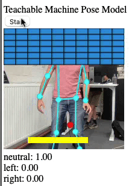

# ML5.js

As a next step, we'll use some existing ML models in our browsers, using the [ML5.js library](https://ml5js.org/).

The ML5 library is built on top of Tensorflow.js - making it a bit easier to use machine learning models in your javascript application.

[Explore some of the examples made by Andreas Refsgaard](https://ml5-fellowship-2020.github.io/examples/) to get a grasp of the capabilities of ML5. Note that the examples are using [P5.js](https://p5js.org/) as well, which is a framework for creative coding in javascript. It comes with features to easily setup a a canvas, webcam, load images, draw loop, etc... However, P5 is not a requirement for ML5, you can use ML5 with your vanilla javascript code as well.

There are a few examples available in vanilla javascript as well on [the ml5 repo](https://github.com/ml5js/ml5-library/tree/main/examples/javascript).

A lot of the things we're doing in the course, is based on the [Beginners Guide to Machine Learning in Javascript](https://www.youtube.com/playlist?list=PLRqwX-V7Uu6YPSwT06y_AEYTqIwbeam3y) from [Daniel Shiffman / The Coding Train 🚂](https://www.youtube.com/channel/UCvjgXvBlbQiydffZU7m1_aw). Make sure to watch that particular playlist for a step-by-step, more in-depth explanation of some of the ML5 apps we're building.

## Image Classifier

As a "hello ml5 world" example, we'll try using the Image Classifier. As you can [read on the ml5 imageClassifier docs](https://learn.ml5js.org/#/reference/image-classifier):

> You can use neural networks to recognize the content of images. ml5.imageClassifier() is a method to create an object that classifies an image using a pre-trained model.
>
> It should be noted that the pre-trained model provided by the example below was trained on a database of approximately 15 million images ([ImageNet](http://www.image-net.org/)). The ml5 library accesses this model from the cloud. What the algorithm labels an image is entirely dependent on that training data -- what is included, excluded, and how those images are labeled (or mislabeled).

First of all, create an HTML document, and link the ml5 library:

```html
<script src="https://unpkg.com/ml5@latest/dist/ml5.min.js"></script>
<script>
{
  // our code goes here
}
</script>
```

We'll need to load an image, the easy way to do it, is using a promise based approach with async/await:

```javascript
const loadImage = src => {
  return new Promise((resolve, reject) => {
    const $img = new Image();
    $img.addEventListener("load", () => resolve($img));
    $img.addEventListener("error", err => reject(err));
    $img.src = src;
  });
};

const init = async () => {
  const $img = await loadImage('images/cat.jpg');
  document.body.appendChild($img);
};

init();
```

Nothing new here. Let's go and add the ml5.imageClassifier, to detect what's displayed in the image.

On the [ml5.imageClassfier docs page](https://learn.ml5js.org/#/reference/image-classifier) you'll read that you can create an instance of the imageClassifier, using `ml5.imageClassifier(model)`. Read about the different parameters on that page - especially the part about the optional callback.

We will used the promise based approach, and "await" for the model to be loaded:

```javascript
const classifier = await ml5.imageClassifier('MobileNet');
console.log('Mobilenet loaded');
```

Run the app, and check the network panel. You'll notice that there's a bunch of extra network requests, which have to do with loading the model. Once the model is fully loaded, you should see the "Mobilenet loaded" message in your console.

Now the final part: detect the contents of the image. [Read about the classify method and all it's options on the ml5 docs](https://learn.ml5js.org/#/reference/image-classifier) and try implementing it, using the async/await syntax. Show the result on the page, underneath the image:

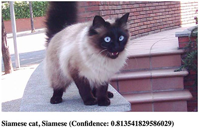

### Video Classifier

When you read  [ml5.imageClassfier docs](https://learn.ml5js.org/#/reference/image-classifier) - you stumbled upon the "video" option: you can pass in a video element when creating the imageClassifier, and do image classification on live video.

1. Create a new html document, and load the ml5 library. Add a video tag which will show the webcam feed:

```html
<video id="video" muted autoplay playsinline></video>
```

2. Display your webcam video feed in the video tag (note, we've omitted setting the $video variable, you'll need to figure that out by yourself)

```javascript
const stream = await navigator.mediaDevices.getUserMedia({ video: true, audio: false });
$video.srcObject = stream;
```

3. Create an imageClassifier instance. Store it in a global variable, and pass in a reference to your video element:

```javascript
classifier = await ml5.imageClassifier('MobileNet', $video);
```

4. Create a separete `loop()` function where you place the `classify()` logic. At the end of that `loop()` function, call `loop()` again, so it keeps classifying:

```javascript
const loop = async () => {
  const results = await classifier.classify($video);
  $label.textContent = `${results[0].label} (Confidence: ${results[0].confidence})`;
  loop();
};
```

You'll get mixed results, depending on if the video is showing something in the ImageNet dataset or not. You'll notice a "low" confidence value when classifying something not quite in the dataset (it guesses I am a mask):

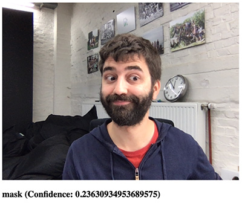

But when showing an image of something in the ImageNet dataset, the confidence is higher (and the classification is more correct:

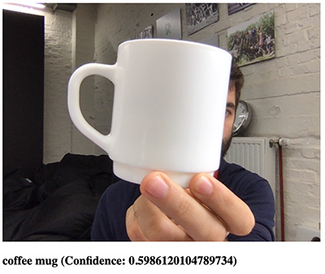

## Transfer Learning

In a next experiment, we'll use "Transfer Learning" to inject our own, custom training samples in the ImageNet model, and get it to recognize "new" classes of images. A live example of the possibilities of Transfer Learning is [Google's Teachable Machine](https://teachablemachine.withgoogle.com), which we've covered earlier.

[We'll use the ml5 featureExtractor](https://learn.ml5js.org/#/reference/feature-extractor) to apply Transfer Learning in our app.

1. Create a new html document, and load the ml5 library
2. Display your webcam video feed on the page.
3. Initialize the featureExtractor:

```javascript
featureExtractor = await ml5.featureExtractor('MobileNet').ready;
```

4. ... and create a classifier, passing in a reference to the video tag:

```javascript
classifier = featureExtractor.classification($video);
```

Note: you might get an error in Safari:

> Unhandled Promise Rejection: TypeError: n.videoElt.captureStream is not a function. (In 'n.videoElt.captureStream()', 'n.videoElt.captureStream' is undefined)

This is because ml5 is trying to get the stream reference using [captureStream](https://developer.mozilla.org/en-US/docs/Web/API/HTMLMediaElement/captureStream) which is not supported by Safari. You can easily polyfill this by defining this function yourself:

```javascript
if (!$video.captureStream) {
  $video.captureStream = () => stream;
}
```

5. Add 3 buttons to the page: a button to classify an image as class "one", a button to classify an image as class "two" and a button to start training. Note that we've specified the classification label as a data attribute `data-label`:

```html
<button id="button1" data-label="one">One</button>
<button id="button2" data-label="two">Two</button>
<button id="trainButton">Train</button>
```

6. Add a click event listener to button1 and button2. The event handler adds a sample to the classifier:

```javascript
const buttonClickHandler = e => {
  const $button = e.currentTarget;
  const label = $button.dataset.label;
  classifier.addImage(label);
};
```

7. Add a click event listener to the training button, in it's event handler you kick off the training process, passing in a progress callback:

```javascript
const trainClickHandler = e => {
  classifier.train(whileTraining);
};

const whileTraining = (loss) => {
  if (loss === null) {
    console.log('Training Complete');
  } else {
    console.log(`Training (loss: ${loss})`);
  }
};
```

8. When training is complete (inside the `whileTraining` function, when loss is equal to null), you can start the same `loop()` logic as in the previous exercise.

Launch the app, and add samples for classification one and classification two. For example: in samples for classification one you are in the frame, and classification two you are outside of the frame. Add at least 15 samples for each scenario, and make sure to move around the frame (when you are in the frame...) to get sufficient different samples. After training, the app should be pretty confident about each scenario.

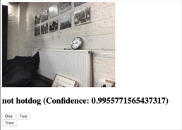

### Saving / Loading the model state

Having to retrain the model every time you launch the application isn't really practical. Luckely, you can save the state of the model once it's trained, and load that saved state when the application launches.

Add a button to save the model, and link an event handler to the `click` event:

```javascript
const saveClickHandler = e => {
  classifier.save();
};
```

Once the model is trained, click this save button, which will offer you to download a json file and a weights.bin file.

> You should get both files. If you don't, try running this part in Google Chrome.

If you want to use this trained model in your app, it's as simple as calling the `classifier.load` method, passing in the path to the json file. You can do this at startup, right after the classifier is instantiated:

```javascript
await classifier.load('models/piglet/model.json');
loop();
```

### Things to do

Try expanding this application:

- Trigger different sounds, based on the classification
- Replace keyboard input with this classifier to control an arcade game

### Transfer Learning - Regression

Instead of doing classification, we can also use transfer learning to do regression: calculate a single, numerical value based on an input.

1. Remove the 2 buttons from the page. Instead, you'll add a slider and a button to add a sample:

```html
<input id="slider" type="range" min="0" max="1" value="0.5" step="0.1" />
<button id="labelButton">Label</button>
```

2. Create a regressor instead of a classifier:

```javascript
regressor = featureExtractor.regression($video);
```

3. Every time you click the labelButton, you'll add a sample to the regressor. This will tell the regressor to what numerical value the video currently corresponds:

```javascript
const labelClickHandler = e => {
  regressor.addImage(parseFloat($slider.value));
};
```

4. The results structure is a bit different, as we don't have multiple classification labels anymore. Update the `loop()` function to show this value:

```javascript
const results = await regressor.predict($video);
$label.textContent = `${results.value})`;
```

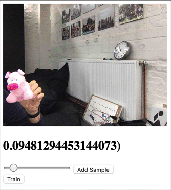

Try to expand on this technique:

- Map the position of a rectangle to the value
- Explore [Tone.js](https://tonejs.github.io) and see how you can map a frequency to the regression value

## KNN Classification

K-Nearest-Neighbour classification is a way to label data, based on the "distance" of that data to known, labeled data.

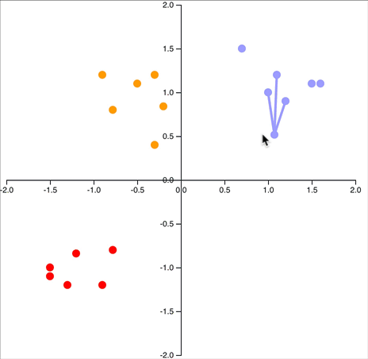

In the GIF above you can see 2-dimensional data (x and y positions) being mapped to known data, based on the Euclidean distance. You can [test a live version of this at the "How to build a Teachable Machine with TensorFlow.js" page](https://observablehq.com/@nsthorat/how-to-build-a-teachable-machine-with-tensorflow-js#-o-0-nearest-neighbors).

Using this technique, we can map K-dimensional data to their nearest neighbors. Us humans have a difficulty understanding more than 3 or 4 dimensions. However, the math to calculate the distance and the logic to map an unknown datapoint to a class remains the same.

The advantage here is that we won't need a separate training step and can classify (image) data in real time. We can tweak the model while it is running.

Our app will be similar to the previous classification app, except we won't have a training step. So, create a basic app, showing your webcam video stream and 2 buttons we'll press to classify the image:

```html
<body>
  <video id="video" autoplay width="320" height="240"></video>
  <h2 id="label">Loading Webcam...</h2>
  <div>
    <button id="button1" data-label="one">One</button>
    <button id="button2" data-label="two">Two</button>
  </div>
</body>
```

We'll even create the same featureExtraction as in the previous app. However, after initializing it, we'll create a KNNClassifier, instead of a featureExtractor.classification:

```javascript
featureExtractor = await ml5.featureExtractor('MobileNet').ready;
// classifier = featureExtractor.classification($video);
knn = ml5.KNNClassifier();
```

Every time we press one of the classification buttons, we'll add the feature data of the current webcam image to the knn classifier. Note that this is not the full RGB data, but a reduced set of image "features" created by the feature extractor.

First of all, it's interesting to see this feature data:

```javascript
// in the button click handler
const logits = featureExtractor.infer($video);
logits.print();
```

You'll see a "Tensor" being logged in your console:

```json
Tensor
     [[0, 0.275391, 1.4118662, ..., 0.0468513, 0.2281258, 0.1108307],]
```

This Tensor is an internal data structure from [Tensorflow.js](https://www.tensorflow.org/js), the framework ml5.js uses internally.

Now, you'll add this Tensor to the classifier:

```javascript
knn.addExample(logits, label);
```

We'll also setup a loop, where you'll be classifying the image continuously:

```javascript
const loop = async () => {
  if (knn.getNumLabels() > 0) {
    const logits = featureExtractor.infer($video);
    const classification = await knn.classify(logits);
    console.log(classification.label);
  }
  requestAnimationFrame(loop);
};
```

Run the app, and classify your two scenarios. You should be able to add examples while running, and see the model improve in real time.

### Save - Load KNN

Just like before, you can save the model state and load it again, so you don't need to retrain all of the time:

```javascript
// saving the knn model state
knn.save()
```

```javascript
// loading the knn model state
await knn.load('models/knn/myKNN.json')
```

## KNN + Posenet

We've passed in images as samples for our KNN classifier, but you can pass in any sort of data. Let's take a look at passing posenet coordinates to the classifier (as we've done with Google Teachable Machine...).

There's an example on https://learn.ml5js.org/#/reference/knn-classifier?id=examples, but let's build it step by step, according to our coding standards.

Start with a basic app where you show a video on screen, two buttons and a knn classifier instance:

```html
<body>
  <video id="video" autoplay width="320" height="240"></video>
  <div>
    <button id="button1" data-label="one">One</button>
    <button id="button2" data-label="two">Two</button>
  </div>
  <h2 id="label">Loading Webcam...</h2>
  <script src="https://unpkg.com/ml5@latest/dist/ml5.min.js"></script>
  <script>
  {

    const $video = document.getElementById('video');
    const $label = document.getElementById('label');
    const $button1 = document.getElementById('button1');
    const $button2 = document.getElementById('button2');

    let knn;

    const init = async () => {
      const stream = await navigator.mediaDevices.getUserMedia({ video: true });
      $video.srcObject = stream;

      // bugfix safari
      if (!$video.captureStream) {
        $video.captureStream = () => stream;
      }

      knn = ml5.KNNClassifier();

      $button1.addEventListener('click', buttonClickHandler);
      $button2.addEventListener('click', buttonClickHandler);
    };

    const buttonClickHandler = e => {
      const $button = e.currentTarget;
      const label = $button.dataset.label;
    };

    init();
  }
  </script>
</body>
```

Create a global poseNet variable, and initialize it in the init function:

```javascript
poseNet = await ml5.poseNet($video).ready;
```

Create a global variable `poses` where you'll store the poseNet results:

```javascript
let poses = [];
```

Listen for the `pose` event and store the result in the poses global:

```javascript
poseNet.on('pose', onPose);
```

```javascript
const onPose = (results) => {
  poses = results;
};
```

Create a requestAnimationFrame `loop()` where you log the poses:

```javascript
const loop = async () => {
  console.log(poses);
  requestAnimationFrame(loop);
};
```

Don't forget to kick-off this `loop()` in your `init()` function and test the app. You should see pose information logged in your console.

### Drawing the skeleton

If we want to draw the skeleton, we'll need a canvas.

Add a canvas tag after the video element:

```html
<canvas width="320" height="240" id="output"></canvas>
```

Create a `const $output` global, which refers to this canvas.
Create a `let ctx` global variable, and initialize it in the `init()` function:

```javascript
ctx = $output.getContext('2d');
```

In your `loop()` method, draw the video element to the canvas:

```javascript
ctx.drawImage($video, 0, 0, 320, 240);
```

Test the app, you should see a dual video:

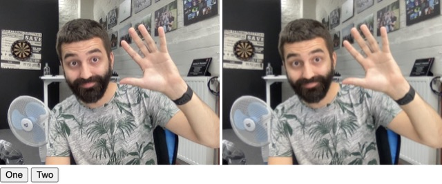

Try hiding the video using `display: none;`:

```html
<video id="video" autoplay width="320" height="240" style="display: none;"></video>
```

Test in both Chrome and Safari. What do you notice?

Adjust the logic to a 1x1, absolute positioned pixel and test again:

```html
<video id="video" autoplay width="320" height="240" style="width: 1px; height: 1px; position: absolute;"></video>
```

Take a look at the poseNet example [on the KNN page](https://learn.ml5js.org/#/reference/knn-classifier?id=examples) - incorporate drawing the keypoints into your code, so that you can see circles on the skeleton points:

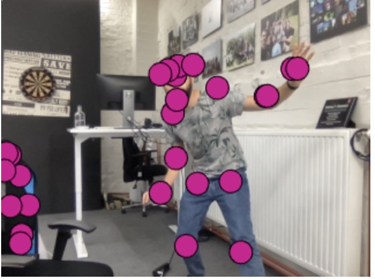

### Classifying poses

We now need to add examples to our KNN classifier. Instead of raw image data, we'll take the coordinates & confidence values of the pose keypoints.

In the button click handler, let's add that data from the first pose in the array (if present):

```javascript
const buttonClickHandler = e => {
  const $button = e.currentTarget;
  const label = $button.dataset.label;
  if (poses.length > 0) {
    const poseArray = poses[0].pose.keypoints.map(p => [p.score, p.position.x, p.position.y]);
    knn.addExample(poseArray, label);
  }
};
```

We now need to execuse the classification in our `loop()`. The logic is very similar to the image example:

```javascript
if (knn.getNumLabels() > 0) {
  if (poses.length > 0) {
    const poseArray = poses[0].pose.keypoints.map(p => [p.score, p.position.x, p.position.y]);
    const results = await knn.classify(poseArray);
    $label.textContent = `${results.label} (Confidence: ${results.confidences[results.classIndex]})`;
  }
}
```

Train your KNN classifier with some poses and see the classification at work!

Try saving / loading your classifier, and getting the breakout exercise working with this code.

# Next steps

We've shown you how to train your models using Teachable Machine and the ML5 KNN classifier. ML5 contains a lot of other models. Explore the ML5 documentation and examples and try applying KNN to any of the other ones.

# Exploring models on Google Colab

A lot of the more recent AI models require a beefy nvidia GPU to run. You might not have a GPU that meets that requirement. Luckely, there are cloud options available to run these models on a remote server.

One of the free options to do so is Google Colab. You can create and run Python notebooks from the browser, executing the code on Google's powerful servers.

A good starting point for finding Google Colab notebooks is https://aihub.cloud.google.com/

## Image Classification with Mobilenet

As a first test, we'll run an image classifier, to identify the contents of an image. This might not be the best case to run on a beefy GPU (as mobilenet even has implementations to run in the browser, on mobile phones). However, we'll run into some common Google Colab issues, without spending too much time waiting for code to complete (as executing a mobilenet model doesn't ask much from the system).

Do a search for "label:Classification" on on https://aihub.cloud.google.com/. You should look for the "Mobile Net" notebook. Click on the notebook in the search results](https://aihub.cloud.google.com/u/0/p/products%2Fafc076d6-3017-49b2-a5ee-0af4ba514f53). On the resulting page, you should find a [Run in Google Colab](https://colab.research.google.com/github/tensorflow/models/blob/master/research/slim/nets/mobilenet/mobilenet_example.ipynb) link. Click it to open the notebook in Google Colab.

A Colab notebook is a combination of text and code block. Read through the notebook and, whenever you encounter a code block, run it by clicking on the "play" icon (visible on hover over the square brackets:)

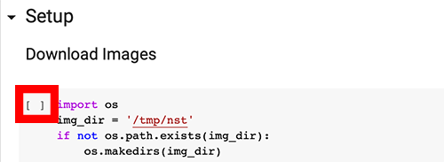

Wait for a block to finish executing before running the next one.

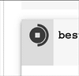

Some blocks finish fast (such as a function definition block), others might take a couple of minutes to finish. Once a block finished, you'll see a number inside the square brackets (or a play icon if that block is still active):

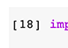

### Error: "ModuleNotFoundError: No module named 'tf_slim'"

In the Checkpoint based inference block, you might run into the following error:

> ModuleNotFoundError: No module named 'tf_slim'

A Google search learns us that 'tf_slim' is not installed by default on Colab and we should install it using `!pip install tf_slim`. We'll execute this command in a new, separate block.

Look for the __+ Code__ button and click it.

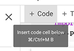

In the new block, put the command you want to execute:

```
!pip install tf_slim
```

Move the block up or down by using the arrow buttons, so that it becomes the first block of the notebook.

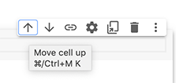

Try running the block again. Another issue arises:

> RuntimeError: tf.placeholder() is not compatible with eager execution.

The reason you're getting this error is that Google Colab is running Tensorflow 2 by default, but the code we are running is Tensorflow 1. We'll need to make sure the runtime uses Tensorflow 1 instead.

Create another code block, and move it to the top of the notebook, right above the tf_slim block we added earlier. In this block, you'll set the Tensorflow version to version 1:

```python
%tensorflow_version 1.x
import tensorflow as tf
print(tf.__version__)
```

Execute that block. If you get the message "TensorFlow is already loaded. Please restart the runtime to change versions.", go to Runtime > Restart Runtime:

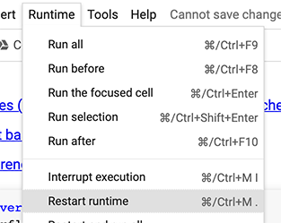

Go through each block again, including our 2 newly added blocks. When executing, the first block should say we're running Tensorflow 1:

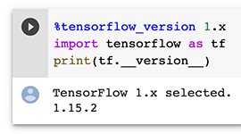

Alas, our python block will throw another error:

> AttributeError: module 'tensorflow._api.v1.compat.v1' has no attribute 'contrib'

There's an easy fix: change the import of tensorflow (the first line of that block):

```diff
- import tensorflow.compat.v1 as tf
+ import tensorflow as tf
```

The blocks should run fine now, and should classify a demo image as a "panda":

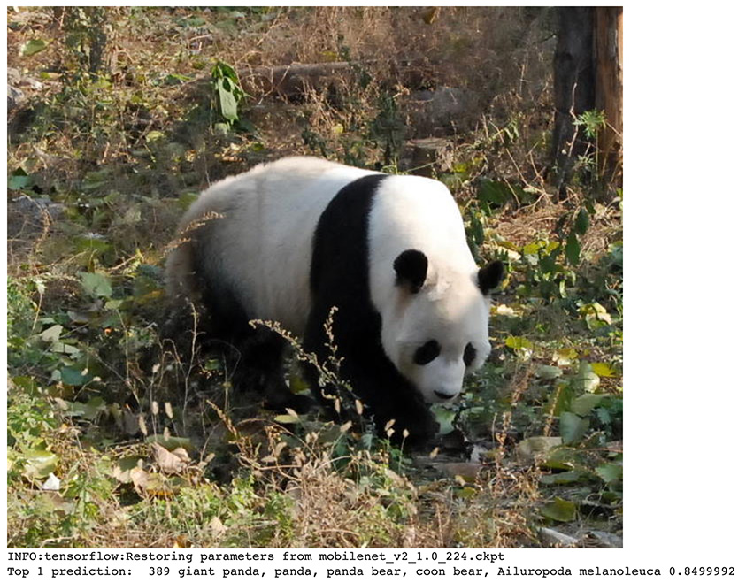

### Classify an image of our own

Let's try classifying an image we upload. You could either add a Code Block with a wget command, to fetch an image from a url (which is how the panda.jpg ended up on Colab, try to find the command in the Prerequisites section!).

An alternative is to upload a file through Colab. In the left section of your screen, you'll find a "folder" icon to go to the file explorer.

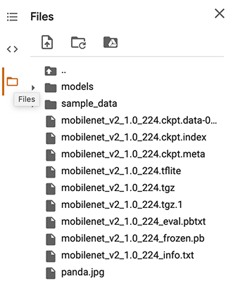

Click the upload icon and upload a jpg of your own. Change the "panda.jpg" mentions in the colab block to the name of your uploaded file and run the classifier again!

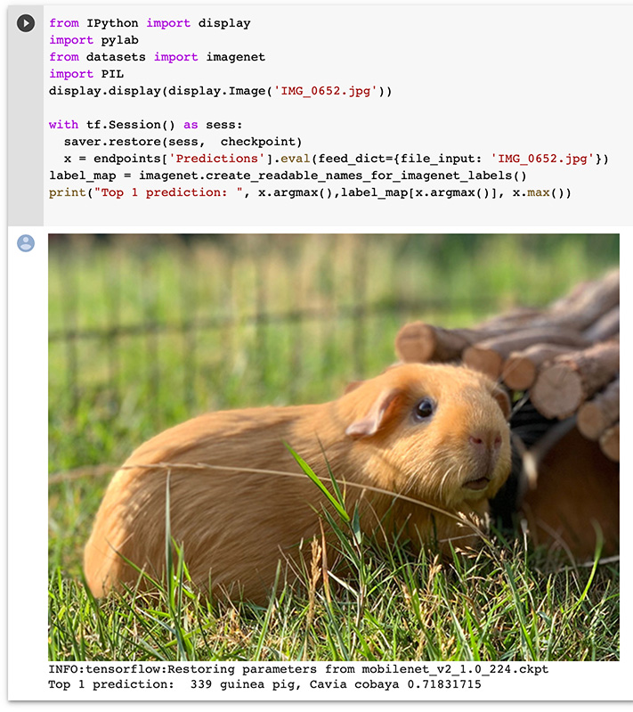

## Neural Style Transfer with tf.keras

In this next exploration, we'll run a Style Transfer model. A Style Transfer model applies the "style" of one component to another component. This can be images, but could also be sound (e.g. music).

Do a search for "Neural Style" on https://aihub.cloud.google.com/. You'll find a couple of notebooks. We'll work with the ["Neural Style Transfer with tf.keras" notebook](https://aihub.cloud.google.com/u/0/p/products%2F7f7495dd-6f66-4f8a-8c30-15f211ad6957). 

Note: some blocks can take quite a while to run (such as the blocks calling into `run_style_transfer`)! Be patient 🙂. Go through the notebook up until "Try it on other images"

### Try it on other images

In the "Try it on other images" section you can see a couple of code blocks loading an image and style image. Let's try using an image of our own.

Open the file explorer and click on the two dots to navigate one level up:

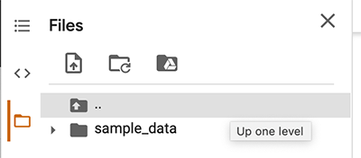

Navigate to /tmp/nst and rightclick that nst folder. Choose upload and upload a photo of your own:

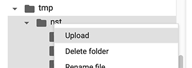

Change one of the example blocks and try stylizing an image of your own!

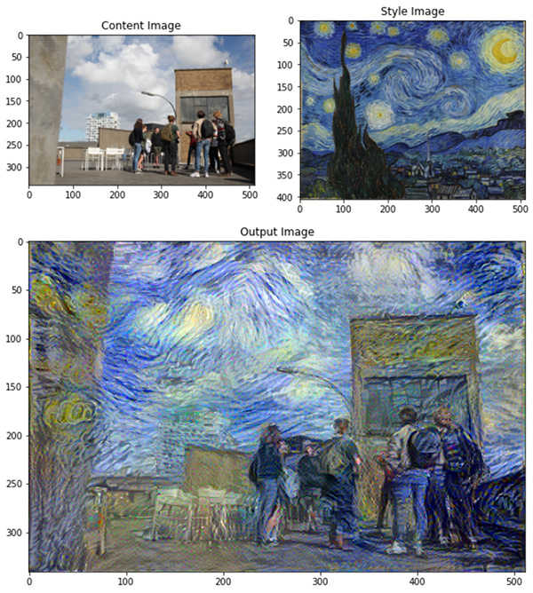

## Train and convert in the cloud: QuickDraw

As a next project, we'll train a model on a cloud GPU, and convert it for usage in Tensorflow.js.

[Zaid Alyafeai](https://twitter.com/zaidalyafeai) has created a [medium post, walking you through the necessary steps to create a QuickDraw recognizer](https://medium.com/tensorflow/train-on-google-colab-and-run-on-the-browser-a-case-study-8a45f9b1474e). Following along with that online guide, which will take you through the necessary steps on Google Colab and provides some Tensorflow.js snippets.

At time of writing we ran into one little issue in the "The Model" section:

> module 'tensorflow._api.v2.train' has no attribute 'AdamOptimizer'

Look for the line `adam = tf.train.AdamOptimizer()` and replace it with `adam = tf.optimizers.Adam()`

Here's a starter html template, which has the drawing logic in place. Fill in the gaps, based on the walkthrough!

```html
<!DOCTYPE html>
<html lang="en">
<head>
  <meta charset="UTF-8">
  <meta name="viewport" content="width=device-width, initial-scale=1.0">
  <meta http-equiv="X-UA-Compatible" content="ie=edge">
  <title>QuickDraw</title>
  <style>
  body {
    background: #cccccc;
  }
  </style>
</head>
<body>
  <h1>Draw</h1>
  <canvas id="c" width="400" height="400"></canvas>
  <button id="btnReset">Clear Canvas</button>
  <ol id="result">
  </ol>
  <script src="https://cdnjs.cloudflare.com/ajax/libs/tensorflow/1.2.10/tf.min.js" integrity="sha256-HCgGF6GfUpPqCZc05QADRrfxnJ3UO1fqFJUZGx0U8Cc=" crossorigin="anonymous"></script>
  <script>
  {

    const $canvas = document.getElementById("c");
    const ctx = $canvas.getContext("2d");
    const $btnReset = document.getElementById('btnReset');
    const $result = document.getElementById('result');

    let model, classNames, mouseIsDown = false, coords = [];

    const init = async () => {
      // uncomment and correct the paths below
      // model = await tf.loadLayersModel('models/quickdraw/model.json');
      // classNames = (await (await fetch('models/quickdraw/class_names.txt')).text()).split("\n").filter(name => name.length > 0);

      $canvas.addEventListener('mousedown', startDrawing);
      $canvas.addEventListener('mousemove', draw);
      window.addEventListener('mouseup', stopDrawing);
      $btnReset.addEventListener('click', resetCanvas);

      resetCanvas();
    };

    const resetCanvas = () => {
      coords = [];
      ctx.fillStyle = 'white';
      ctx.fillRect(0, 0, $canvas.width, $canvas.height);
    };

    const startDrawing = e => {
      mouseIsDown = true;
      ctx.save();
      ctx.lineWidth = 10;
      ctx.beginPath();
      ctx.moveTo(e.offsetX, e.offsetY);
      coords.push({x: e.offsetX, y: e.offsetY});
    };

    const stopDrawing = e => {
      if (!mouseIsDown) {
        return;
      }
      mouseIsDown = false;
      ctx.closePath();
      ctx.restore();
      // todo: classify here
    };

    const draw = e => {
      if (!mouseIsDown) {
        return;
      }
      ctx.lineTo(e.offsetX, e.offsetY);
      ctx.stroke();
      coords.push({x: e.offsetX, y: e.offsetY});
    };

    init();

  }  
  </script>
</body>
</html>
```

## Other Colab projects

There are quite a few interesting ML projects you can run on Colab. Here's a couple of them you might want to try:

- Generate and edit photorealistic faces with StyleGAN - [Youtube: Face editing with Generative Adversarial Networks](https://www.youtube.com/watch?v=dCKbRCUyop8)
- Control a photo avatar using your webcam - [Github: Open Avatarify](https://github.com/alievk/avatarify)
- Text generation: [GPT-2 with javascript interface](https://colab.research.google.com/github/gpt2ent/gpt2colab-js/blob/master/GPT2_with_Javascript_interface_POC.ipynb)
- Create a cartoon version of yourself: [Toonify](https://www.justinpinkney.com/toonify-yourself/)

If you want to get a deeper understaning of Deep Learning networks, I highly recommend [taking a look at Jeff Heaton's course](https://github.com/jeffheaton/t81_558_deep_learning), which includes Colab notebooks and accompanying Youtube explainer videos.

## More on Tensorflow.js

- [Coding Traing Playlist: Introduction to TensorFlow.js - Intelligence and Learning](https://www.youtube.com/watch?v=Qt3ZABW5lD0&list=PLRqwX-V7Uu6YIeVA3dNxbR9PYj4wV31oQ)
- [Medium Post: A Gentle Introduction to TensorFlow.js](https://medium.com/tensorflow/a-gentle-introduction-to-tensorflow-js-dba2e5257702)

# Other Resources

- [The Neural Aesthetic @ ITP-NYU :: 06 Generative models](https://www.youtube.com/watch?v=U_u5CuLGVSc)
- [Sónar+D Masterclasses 2019: The Limits of Learning, with Kyle McDonald](https://www.youtube.com/watch?v=kWvHjp8vifM)
- [The Current State of AI Generated Art](https://www.youtube.com/watch?v=aqW-8WtYJvw)
- [Getting Started with Disco Diffusion](https://weirdwonderfulai.art/resources/getting-started-with-disco-diffusion/)