# React Native

React Native allows you to write native applications for Android and iOS using React. Ideally, you can write your code once using JavaScript / React and create platform specific builds.

See also: https://reactnative.dev

## Prerequisites

Make sure to install XCode (through App store) and homebrew on your system. You'll need this when you want to run projects on the iOS Simulator and / or when projects are using CocoaPods for certain native dependencies.

## Expo

We'll build react native apps as managed expo apps instead of bare react native apps. This provides us with an improved developer experience and is sufficient for our applications.

Go through the following guides in the documentation (https://docs.expo.dev). Make sure to have the required stack installed on your system (see https://docs.expo.dev/get-started/installation/#requirements)

1. Get Started
2. Tutorial

## React Navigation

After covering the Expo basics, we want to add navigation to our apps. The de-facto library for navigation in react native apps is react navigation: https://reactnavigation.org

Go through the "Fundamentals" on https://reactnavigation.org/docs/getting-started

## Strapi + React Native: Plant Based Barista

We'll create a simple React Native App to enter orders for a fictional coffee bar.

Create a new, managed blank React Native project using expo init:

```
npx create-expo-app barista-react-native
```

Navigate into that project folder, and run `expo start`:

```
cd barista-react-native
npx expo start
```

Follow the terminal instructions to open the app on your phone using the Expo Go app, or in the simulator.

### Coffees List

Create a folder **components**, and a file **CoffeesListScreen.js** inside of that folder. We'll display the available coffees people can order in this screen. This component will show a list of available coffees, with their prices.

As a start, we'll load a static file (we'll load them from a Strapi backend in a later step). Put the **coffees.json** file (you can find this file in the [projects/barista](projects/barista) folder) in the **assets** folder.

```javascript
import React from 'react';
import { FlatList, StyleSheet, Text, View } from 'react-native';

import coffees from '../assets/coffees.json';

export const CoffeesListScreen = () => {

  const renderItem = ({ item }) => {
    return (
      <View style={styles.item}>
        <Text style={styles.title}>{item.plantbased ? '🌱 ' : ''}{item.name}</Text>
        <Text style={styles.price}>&euro; {item.price.toFixed(2)}</Text>
      </View>
    );
  };

  return (
    <View style={styles.container}>
      <FlatList data={coffees} renderItem={renderItem} keyExtractor={item => `${item.id}`} />
    </View>
  )
};

const styles = StyleSheet.create({
  container: {
    flex: 1
  },
  item: {
    flexDirection: 'row',
    justifyContent: 'space-between',
    alignItems: 'center',
    backgroundColor: '#ffffff',
    padding: 20,
    borderBottomWidth: 1,
    borderBottomColor: '#cccccc'
  },
  title: {
    fontSize: 24,
  },
  price: {
    fontSize: 18,
  },
});
```

Make sure to load this component in your App.js:

```javascript
import React from 'react';
import { CoffeesListScreen } from './components/CoffeesListScreen';

export default function App() {
  return (
    <CoffeesListScreen />
  );
}
```

The result should look something like this:

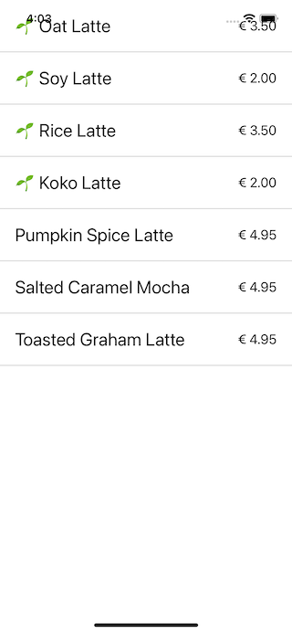

Ignore the fact that the app ui is showing underneath the  status bar, this will be fixed in a later step.

### Place Order Screen

A second screen we'll have, is a summary of the order. Create a file **components/PlaceOrderScreen.js**, where you'll have the following items:

- A FlatList containing the order items (coffee and amount)
- The total calculated price
- 2 textfields for first and last name
- A "Place Order" Button

As a start, we'll use a hardcoded array of order information.

```javascript
import React, { useState } from 'react';
import { Button, FlatList, StyleSheet, Text, TextInput, View } from 'react-native';

export const PlaceOrderScreen = () => {

  // test data
  const orderItems = [
    {
      coffee: {
        id: 1,
        name: "Coffee 1",
        price: 1.5
      },
      amount: 1
    },
    {
      coffee: {
        id: 2,
        name: "Coffee 2",
        price: 2
      },
      amount: 3
    }
  ];

  const [firstName, setFirstName] = useState('');
  const [lastName, setLastName] = useState('');

  const calculateTotal = () =>
    orderItems.reduce((total, orderItem) => {
      return total + orderItem.coffee.price * orderItem.amount;
    }, 0);

  const placeOrder = async () => {
    console.log("place order");
  };

  const renderItem = ({ item }) => {
    return (
      <View style={styles.item}>
        <Text style={styles.title}>{item.coffee.name}</Text>
        <Text style={styles.amount}>{item.amount}</Text>
      </View>
    );
  };

  return (
    <View style={styles.container}>
      <FlatList data={orderItems} renderItem={renderItem} keyExtractor={item => `${item.coffee.id}`} />

      <View style={styles.totalContainer}>
        <Text style={styles.title}>Total:</Text>
        <Text style={styles.amount}>&euro; {calculateTotal().toFixed(2)}</Text>
      </View>
      <View style={styles.buttonContainer}>
        <TextInput style={styles.textInput} placeholder="First Name" value={firstName} onChangeText={setFirstName} />
        <TextInput style={styles.textInput} placeholder="Last Name" value={lastName} onChangeText={setLastName} />
        <Button title="Place Order" onPress={() => placeOrder()} />
      </View>
    </View>
  )
};

const styles = StyleSheet.create({
  container: {
    flex: 1
  },
  item: {
    flexDirection: 'row',
    justifyContent: 'space-between',
    alignItems: 'center',
    backgroundColor: '#ffffff',
    padding: 20,
    borderBottomWidth: 1,
    borderBottomColor: '#cccccc'
  },
  title: {
    fontSize: 24,
  },
  amount: {
    fontSize: 18,
  },
  totalContainer: {
    flexDirection: 'row',
    justifyContent: 'space-between',
    alignItems: 'center',
    backgroundColor: '#ffffff',
    padding: 20
  },
  buttonContainer: {
    padding: 20
  },
  textInput: {
    backgroundColor: '#ffffff',
    borderColor: "#cccccc",
    borderWidth: 1,
    padding: 16,
    marginBottom: 20
  }
});
```

In **App.js**, swap the CoffeesListScreen component with this new PlaceOrderScreen to test this view. The result should look something like this:

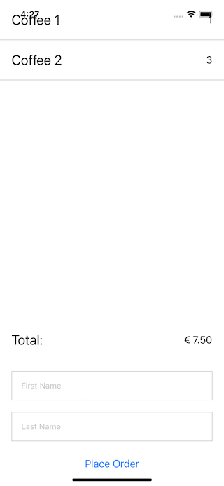

### Tabs

Each of our screens should live on a separate tab. Adjust the App.js, so it has a **NavigationContainer** as a root tag, with a **TabNavigator** and **Screens** inside:

```javascript
import React from 'react';
import { NavigationContainer } from '@react-navigation/native';
import { createBottomTabNavigator } from '@react-navigation/bottom-tabs';
import { CoffeesListScreen } from './components/CoffeesListScreen';
import { PlaceOrderScreen } from './components/PlaceOrderScreen';

const Tab = createBottomTabNavigator();

export default function App() {
  return (
    <NavigationContainer>
      <Tab.Navigator>
        <Tab.Screen name="List" component={CoffeesListScreen} options={{
          title: "Coffees"
        }} />
        <Tab.Screen name="Order" component={PlaceOrderScreen} options={{
        }} />
      </Tab.Navigator>
    </NavigationContainer>
  );
}
```

We're getting an error about unresolved modules:

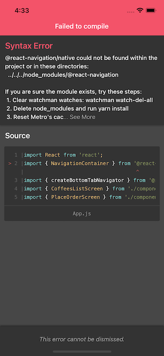

We're seeing it complaining about `@react-navigation/native`. Add that module to your project, using npm install:

```
npm install @react-navigation/native
```

Trigger the shake command in the simulator, and force a reload:

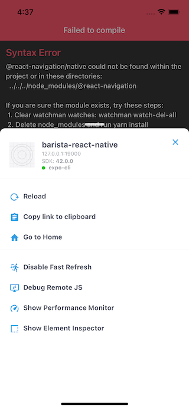

It's now complaining about `@react-navigation/bottom-tabs`:

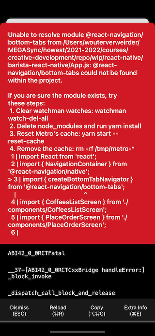

Go through the same "npx expo install" process, to add that module.

We now should have working tabs in our application:

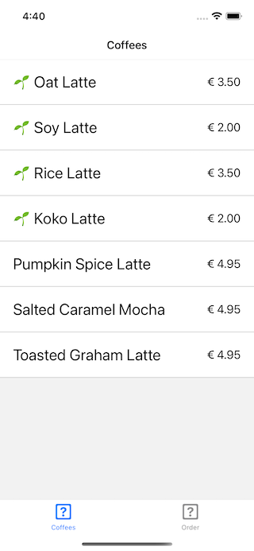

### Tab Icons

You can add an icon to the tab bar, by passing a [tabBarIcon](https://reactnavigation.org/docs/bottom-tab-navigator#tabbaricon) to the screen options.

Expo includes a lot of vector icon libraries. Take a look at https://icons.expo.fyi and choose an icon for the CoffeesList and PlaceOrder screens.

### Keeping track of orders: Zustand Store

On our CoffeesList screen, we want to add coffees to our order (which is further handled on the PlaceOrder screen). We'll manage this shared data in a [Zustand store](https://github.com/pmndrs/zustand).

Add a file **store/coffeeStore.js** to your project, where you'll export a `useCoffeeStore` function:

```javascript
import create from 'zustand'

const useCoffeeStore = create(set => ({
  orderItems: [],
}))

export { useCoffeeStore }
```

Update the PlaceOrderScreen component, so it uses the orderItems from the zustand store instead of the hardcoded array in that component:

```javascript
export const PlaceOrderScreen = () => {

  const orderItems = useCoffeeStore(state => state.orderItems);
```

The Order screen should now be empty. Try setting a test order in the coffeeStore:

```javascript
const useCoffeeStore = create(set => ({
  orderItems: [
    {
      coffee: {
        id: 1,
        name: "Coffee 1",
        price: 1.5
      },
      amount: 1
    },
    {
      coffee: {
        id: 2,
        name: "Coffee 2",
        price: 2
      },
      amount: 3
    }
  ],
}))
```

The PlaceOrder screen displays the data specified in the store.

Revert the orderItems array in coffeeStore.js again to an empty array.

### Adding coffees to the order

Add an `addToOrder` method to the CoffeesListScreen, and update the `renderItem` method, so it contains a button to add coffees to the order (you'll need to import TouchableOpacity and Ionicons as well...):

```javascript
const addToOrder = coffee => {
  console.log(`Add to order: ${coffee.id}`);
};

const renderItem = ({ item }) => {
  return (
    <View style={styles.item}>
      <View>
        <Text style={styles.title}>{item.plantbased ? '🌱 ' : ''}{item.name}</Text>
        <Text style={styles.price}>&euro; {item.price.toFixed(2)}</Text>
      </View>
      <TouchableOpacity onPress={() => {
        addToOrder(item);
      }}>
        <Ionicons name="add-circle" size={24} color="black" />
      </TouchableOpacity>
    </View>
  );
};
```

The CoffeesList screen should now look something like this:

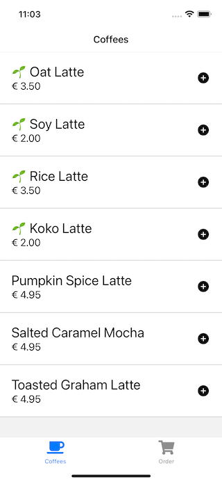

Use the coffee store in your CoffeesList screen, and add the code to push or update order items:

```javascript
const orderItems = useCoffeeStore(state => state.orderItems);

const addToOrder = coffee => {
  console.log(`Add to order: ${coffee.id}`);
  const indexInOrderArray = orderItems.findIndex((check) => check.coffee.id === coffee.id);
  const isAlreadyInArray = (indexInOrderArray > -1);
  if (isAlreadyInArray) {
    orderItems[indexInOrderArray].amount++;
  } else {
    const newOrder = {
      amount: 1,
      coffee: coffee,
    };
    orderItems.push(newOrder);
  }
};
```

Test the app. There are no errors, but the PlaceOrder screen doesn't update consistently when we add / update orders...

Remember references and values from a previous development course? We'll need to assign a new array to the zustand store. We'll also move the adding logic to the store, instead of doing this in our view logic.

```javascript
const useCoffeeStore = create(set => ({
  orderItems: [],
  addOrderItem: (coffee) => {
    set(state => {
      const indexInOrderArray = state.orderItems.findIndex((check) => check.coffee.id === coffee.id);
      const isAlreadyInArray = (indexInOrderArray > -1);
      if (isAlreadyInArray) {
        return { 
          orderItems: state.orderItems.map((orderItem) => {
            if (orderItem.coffee.id === coffee.id) {
              return { ...orderItem, amount: orderItem.amount + 1 };
            }
            return orderItem;
          })
        };
      } else {
        return { orderItems: [...state.orderItems, { amount: 1, coffee }] }
      }
    })
  }
}))
```

The orders added from the CoffeesList should now appear in the PlaceOrder screen.

### Strapi App

We will add a backend to our app, so that coffees and orders are synced with an API.

Open a Terminal, navigate to the folder where you want to create your application, and execute `npx create-strapi-app@latest barista-strapi`, choose for the Quickstart settings.

Run `npm run develop` in the generated folder to start Strapi in dev mode.

### Collection Types

Create a "Coffee" collection type, with the following config:

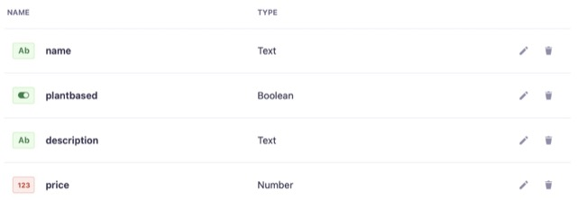

Create an "Order" collection type, with the following config:

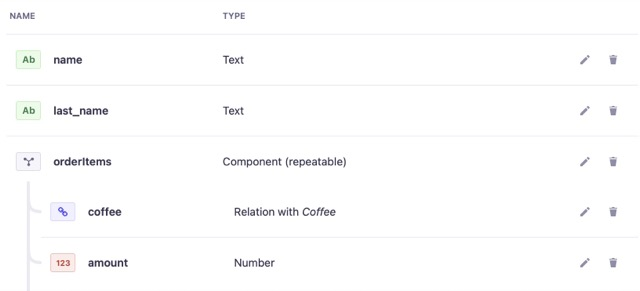

Go to **Settings > Roles > Public** and make sure to set the followin permissions, to allow for API access:

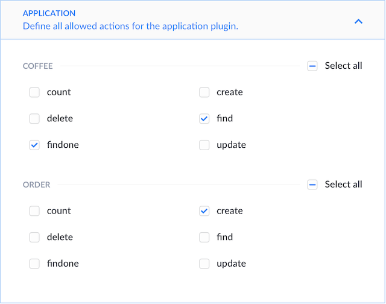

### Content

Take a look at [coffees.json](projects/coffees.json) and make sure to add them to your database using Strapi.

### Loading Coffees from our API

Opening http://localhost:1337/api/coffees should return a JSON response with the coffees from our database. Let's load this instead of the json file in our assets folder.

We'll use the successor of react query as our fetching hook: **TanStack Query**: https://github.com/tanstack/query

Add `@tanstack/react-query` to the dependencies of your react native project:

```
npm install @tanstack/react-query
```

In your App.js, initialize a QueryClient:

```javascript
import { QueryClient, QueryClientProvider } from '@tanstack/react-query'

const queryClient = new QueryClient();
```

Wrap the root tag of your app with a QueryClientProvider, passing down the queryCient you just created:

```javascript
export default function App() {
  return (
    <QueryClientProvider client={queryClient}>
      <NavigationContainer>
        ...
      </NavigationContainer>
    </QueryClientProvider>
  );
}
```

Remove the `import coffees = ...` from your **CoffeesListScreen** component. Replace it with a `useQuery` hook where you fetch the coffees from the strapi backend.

```javascript
const { data: coffees } = useQuery(['coffees'], async () => {
  const response = await fetch('http://localhost:1337/api/coffees');
  const coffees = await response.json();
  return coffees.data.map(coffee => ({
    id: coffee.id,
    ...coffee.attributes,
  }));
});
```

The list now displays the coffees from our Strapi API. It's not a good idea to hardcode the API urls in your apps. Luckely Expo provides us with a mechanism to get values from a config file. Read through the docs at https://docs.expo.dev/workflow/configuration/

Find the **app.json** file in your React Native project root. Add an "extra" key in there, which contains a custom variable:

```json
"web": {
  "favicon": "./assets/favicon.png"
},
"extra": {
  "apiURL": "http://localhost:1337"
}
```

Import the Constants in your CoffeesListScreen (`import Constants from 'expo-constants';`) and use the apiURL setting in your fetch call:

```javascript
const response = await fetch(`${Constants.manifest.extra.apiURL}/api/coffees`);
```

You might need to do an app reload (Shake Gesture > Reload) to get this to work, the app should now use the external apiURL setting and load the coffees.

### Saving an order with our API

Our Strapi API also handles order. By sending a POST request to `http://localhost:1337/api/orders` we can save an order.

Read up on mutations at https://tanstack.com/query/v4/docs/guides/mutations.

Create a mutation with the `useMutation` hook, and update the placeOrder method, so that it posts a valid order object through the mutation:

```javascript
const placeOrderMutation = useMutation(async (orderData) => {
  return await fetch(`${Constants.manifest.extra.apiURL}/api/orders`, {
    method: "POST",
    body: JSON.stringify({ data: orderData }),
    headers: { "Content-Type": "application/json" },
  });
})

const placeOrder = async () => {
  const orderData = { name: firstName, last_name: lastName, orderItems };
  placeOrderMutation.mutate(orderData);
};
```

Place an order and check your Strapi backend. The full order should be saved.

However, our order items are not cleared in the front end. Let's add a `clearOrderItems` method to our `coffeeStore`

```javascript
clearOrderItems: () => {
  set(() => ({ orderItems: [] }))
}
```

Get a reference to that store method in the place order screen:

```javascript
const clearOrderItems = useCoffeeStore(state => state.clearOrderItems);
```

When the mutation was successful, we want to execute that method. Pass a second parameter to the useMutation hook, which will contain an onSuccess callback where we clear the order items:

```javascript
const placeOrderMutation = useMutation(async (orderData) => {
  return await fetch(`${Constants.manifest.extra.apiURL}/api/orders`, {
    method: "POST",
    body: JSON.stringify({ data: orderData }),
    headers: { "Content-Type": "application/json" },
  });
}, {
  onSuccess: () => {
    clearOrderItems();
    setFirstName('');
    setLastName('');
  }
})
```

### Save Progress

Our basic app functionality works. All we need to do now, is add some UX improvements.

When our order is being placed, we want to show a progress indicator to the user. We can use the `isLoading` state from the placeOrderMutation for this:

```javascript
return (placeOrderMutation.isLoading ?
  <View style={{...styles.container, alignItems: 'center', justifyContent: 'center'}}>
    <Text style={styles.title}>Placing Order...</Text>
  </View>
  :
  <View style={styles.container}>
    <FlatList data={orderItems} renderItem={renderItem} keyExtractor={item => `${item.coffee.id}`} />

    <View style={styles.totalContainer}>
      <Text style={styles.title}>Total:</Text>
      <Text style={styles.amount}>&euro; {calculateTotal().toFixed(2)}</Text>
    </View>
    <View style={styles.buttonContainer}>
      <TextInput style={styles.textInput} placeholder="First Name" value={firstName} onChangeText={setFirstName} />
      <TextInput style={styles.textInput} placeholder="Last Name" value={lastName} onChangeText={setLastName} />
      <Button title="Place Order" onPress={() => placeOrder()} />
    </View>
  </View>
)
```

### Order Confirmation

When an order was successfull, we want to navigate to a separate confirmation screen. In order (...) to do that, we'll need to wrap our PlaceOrder component in a **Stack Navigator**.

First of all, let's create the confirmation screen. We'll just use a basic, centered text for now. Create a file **components/OrderConfirmationScreen.js** with the following contents:

```javascript
import React from 'react';
import { StyleSheet, Text, View } from 'react-native';

export const OrderConfirmationScreen = () => {
  return (
    <View style={styles.containerCentered}>
    <Text>Thank you for your order!</Text>
  </View>
  );
};

const styles = StyleSheet.create({
  containerCentered: {
    flex: 1,
    alignItems: 'center',
    justifyContent: 'center'
  }
});
```

Create a file **components/OrderScreen.js**, which contains a stack of two screens: the **PlaceOrderScreen** and the **OrderConfirmationScreen**:

```javascript
import { createNativeStackNavigator } from '@react-navigation/native-stack';
import React from 'react';
import { OrderConfirmationScreen } from './OrderConfirmationScreen';
import { PlaceOrderScreen } from './PlaceOrderScreen';

const Stack = createNativeStackNavigator();

export const OrderScreen = () => {
  return (
    <Stack.Navigator>
      <Stack.Screen
          name="PlaceOrder"
          component={PlaceOrderScreen}
          options={{
            title: "Order"
          }}
        />
      <Stack.Screen
          name="OrderConfirmation"
          component={OrderConfirmationScreen}
          options={{
            title: "Order Confirmation"
          }}
        />
    </Stack.Navigator>
  );
};
```

Finally, include this new OrderScreen instead of PlaceOrderScreen in your **App.js** file:

```javascript
<Tab.Screen name="Order" component={OrderScreen} options={{
  tabBarIcon: ({ color, size }) => (<FontAwesome5 name="shopping-cart" size={size} color={color} />)
}} />
```

Test the app, and read the error:

> Unable to resolve module @react-navigation/native-stack

We haven't added @react-navigation/native-stack to our project yet, so install it:

```
npm install @react-navigation/native-stack
```

It might be possible that the current build is still not loading in your simulator. If that happens, close the app in the simulator, and restart the metro CLI (the currently running yarn start command in your react native project root).

Check the Order tab; you'll notice we've got a duplicate navigation bar:

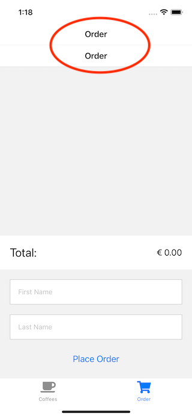

That's because we're nesting two navigators: we've got our root TabNavigator, and a nested StackNavigator. Let's hide the navigation bar for our Order Tab, by setting headerShown to false in **App.js**:

```javascript
<Tab.Screen name="Order" component={OrderScreen} options={{
  headerShown: false,
  tabBarIcon: ({ color, size }) => (<FontAwesome5 name="shopping-cart" size={size} color={color} />)
}} />
```

Let's add the necessary logic to **PlaceOrderScreen** to navigate to the order confirmation screen. First of all, destructure the navigation property:

```javascript
export const PlaceOrderScreen = ({ navigation }) => {
```

Use that navigation instance, to navigate to our confirmation screen. As we've given it the name `OrderConfirmation` in our OrderScreen component, we can use that name in the navigate call:

```javascript
onSuccess: () => {
  clearOrderItems();
  setFirstName('');
  setLastName('');
  navigation.navigate('OrderConfirmation');
}
```

Test the app. It now animates to a separate screen after placing the order:

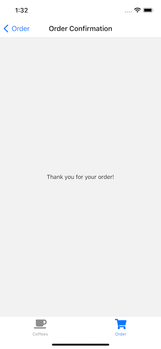

## Where to go from here

We've barely scratched the surface of what you can do using React Native.

- Provide App icons and a splash screen
- Try running the app on your physical device
- Did it actually happen, if it's not on social media? Add an image capture screen with share functionality.
- Take a look at https://github.com/jondot/awesome-react-native